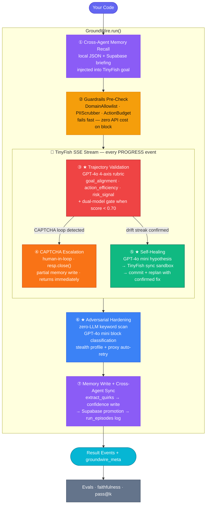

# GroundWire

**Reliability middleware for web agents. One import. Seven features. Zero new infrastructure required.**

> *"TinyFish gives you the agent. GroundWire gives you the SLA."*

---

## What this Project is About

**Web agents fail silently in production. Here's how:**

| The failure | What actually happens | How GroundWire stops it |
|---|---|---|
| Stalls on a cookie modal | Agent loops on the same page forever, returns nothing | **Self-Healing** generates a hypothesis, tests it in a sandbox, and replans with a confirmed fix |
| Drifts toward the wrong goal | Agent wanders off-task — you don't know until you read the output | **Trajectory Validation** scores every 5 steps on a 4-axis rubric and triggers a replan before drift compounds |
| Blocked by Cloudflare | Agent returns a challenge page as its "result" | **Adversarial Hardening** detects the block, classifies it, and auto-retries on a stealth profile with a US proxy |
| CAPTCHA loop | Agent retries the same challenge page 50 times | **CAPTCHA Escalation** closes the stream immediately and routes to human review — never a replan loop |
| PII in the output | Agent returns emails and phone numbers in the result string | **Guardrails** scrub the output before it ever reaches your code |
| Zero visibility | You have no idea any of the above happened | **Memory + Evals** log every quirk, every run, every score — and share them across all your agents |

**You have no idea any of this happened — until GroundWire.**

GroundWire is the layer that goes between your code and TinyFish. It taps into the live SSE event stream, fires seven features automatically on every run, and makes agents actually trustworthy at scale.

```python
# Before
result = requests.post("https://agent.tinyfish.ai/v1/automation/run-sse", ...)

# After — zero other changes
from groundwire import GroundWire
gw = GroundWire.from_env()
result = gw.run(url="https://amazon.com", goal="Get price of AirPods Pro")
```

---

## Architecture



**★ = the three features that prevent silent production failures**

---

## The seven features

---

> [!IMPORTANT]
> ### 🔴 ③ Trajectory Validation — *The live brain. Catches drift before it compounds.*
>
> *"Is the agent actually heading toward the goal — or wandering?"*
>
> Every 5 PROGRESS events, GroundWire scores the live SSE trajectory on four axes:
>
> | Axis | Weight | Meaning |
> |---|---|---|
> | `goal_alignment` | 0.50 | Is the agent heading toward the actual goal? |
> | `action_efficiency` | 0.30 | Is it taking the efficient path? |
> | `risk_signal` | 0.20 | Is it approaching dangerous actions? |
> | **`progress_rate`** | computed | Weighted composite — the gate metric |
>
> When `progress_rate < 0.60` on 2 consecutive checkpoints: **drift confirmed → replan**.
>
> **Dual-model gate:** when GPT-4o's primary score drops below `0.70`, a second GPT-4o call scores the same trajectory independently as a cross-check. The more conservative score wins.
>
> ```
> [validator] step  10 | progress=0.64 | align=0.71 | eff=0.55 | risk=0.22
> [openai]  GPT-4o check: 0.61 | Primary: 0.64 | Using conservative: 0.61
> [validator] ✗  Drift confirmed — generating Reflexion critique
> ```
>
> Replan injects a **checkpoint context**: how many steps completed + don't restart from zero.

---

> [!IMPORTANT]
> ### 🟢 ⑤ Self-Healing — *Hypothesis → sandbox → confirmed fix. Not a guess.*
>
> *"The agent stalled on a cookie modal. We proved the fix before replanning."*
>
> When drift is confirmed, before replanning, GroundWire runs a three-stage cycle using `healer.py`:
>
> 1. **Hypothesise** (GPT-4o mini) — generates a site-behaviour explanation for the stall
>    *"Cookie modal blocks the pricing section on first visit."*
>
> 2. **Sandbox** — fires a real TinyFish sync run (`POST /v1/automation/run`) with the hypothesis prefix injected into the goal. 90s timeout.
>
> 3. **Commit** — if sandbox status is `COMPLETED`: bumps confidence on the local quirk (`+0.15`) and prepends `CONFIRMED FIX: Accept the cookie modal first.` to `state.replan_goal`.
>
> The replanned run starts with **verified site knowledge**, not just a compressed guess.
>
> ```
> [healer] Firing hypothesis sandbox for stripe.com...
> [healer] ✓ Confirmed: Cookie modal blocks pricing section on first visit
> [validator] Compressed replanned goal: CONFIRMED FIX: Accept the cookie modal...
> ```
>
> Max 2 hypothesis attempts per drift event. Gracefully returns `{"healed": False}` when no API key is set or sandbox fails — never blocks the replan.

---

> [!IMPORTANT]
> ### 🔵 ⑥ Adversarial Hardening — *Post-stream block detection and auto-retry. The site fights back — GroundWire wins.*
>
> *"The agent hit a Cloudflare wall. We classified it, swapped profiles, and retried — automatically."*
>
> After the SSE stream completes, `hardener.py` runs a zero-LLM keyword scan on the full event list and COMPLETE payload. If blocked:
>
> 1. **Classify** (GPT-4o mini) → `block_type`: `cloudflare | datadome | captcha | geo_block | rate_limit | login_wall | unknown`
> 2. **Decide**: `escalate_to_human: true` for hard blocks → human review. False → auto-retry.
> 3. **Retry** → re-fires TinyFish with `browser_profile: "stealth"` + optional `proxy_config: {country: "US"}` residential proxy
> 4. **Replace** → if retry succeeds, `state.events` is replaced with the clean retry events before memory write
> 5. **Log** → `record_antibot_event()` + `record_resolution()` written to Supabase `antibot_events` table for cross-agent pattern sharing
>
> ```
> [hardener] 🛡  Block detected — attempting auto-harden and retry for stripe.com
> [hardener] ✓ Auto-recovered from cloudflare block (stealth profile, US proxy)
> ```

---

### 🟣 ① Cross-Agent Memory Recall
*Network-effect site intelligence. Every agent makes the next one smarter.*

Before firing TinyFish, GroundWire pulls two briefings and merges them into the goal:

- **Local memory** (`memory.py`) — per-domain JSON: confidence-weighted quirks, episodic run history, GPT-4o-synthesized semantic profile (every 3 real runs)
- **Shared memory** (`shared_memory.py`) — Supabase: quirks confirmed by 2+ agents cross-machine, promoted once local confidence crosses `1.5×`

```
[memory] Known quirks:
[memory]   - policy page uses lazy-loaded section headers (confirmed 6.0x)
           SHARED SITE MEMORY (3 agents, 4.2x confidence): scroll required before
           section text is accessible
```

Run 1: 11 steps. Run 2 (warm): **6 steps**. Same goal, 45% less navigation.

---

### 🟡 ② Guardrails
*Composable rules that run before and after execution. Fail fast — zero wasted API spend.*

| Rule | When | What |
|---|---|---|
| `DomainAllowlist(["stripe.com"])` | pre-run | Raises before TinyFish fires — zero API cost |
| `PIIScrubber()` | post-run | Redacts emails, phone numbers from result string |
| `ActionBudget(50)` | post-run | Hard-stops runaway agents at step N |

```
[guardrail] Domain 'evil.com' not in allowlist — run blocked.
[guardrail] Output scrubbed: j.doe@example.com → [EMAIL_REDACTED]
```

Guardrails compose via `GuardrailStack([DomainAllowlist(...), PIIScrubber(), ActionBudget(50)])`.

---

### 🟠 ④ CAPTCHA Escalation
*Separate from drift. Routes to human, not into an infinite replan cycle.*

`detect_deterministic_signals()` returns `captcha_detected: True` (not `loop: True`) when 3 identical consecutive actions contain CAPTCHA keywords (`cloudflare`, `challenge`, `verify`, `datadome`, `turnstile`, `hcaptcha`…).

The SSE connection closes immediately. Partial memory is written. The caller gets a `groundwire_meta` event with `action_required: "human_review"` — never a replan that hits the same challenge page again.

```
[validator] 🔒 CAPTCHA detected — human intervention required:
            CAPTCHA/challenge stall: 'waiting for cloudflare challenge to resolve'
```

---

### 🩵 ⑦ Memory Write + Cross-Agent Sync
*Every run teaches the system. Confirmed quirks promoted to the shared network.*

Post-stream (using clean events — retry events if hardener recovered):

1. GPT-4o mini extracts site quirks from the event trajectory → confidence-weighted upsert to local JSON
2. `log_run()` appends the episodic record
3. Every 3rd real run: `consolidate()` synthesizes a one-sentence GPT-4o strategic profile
4. `_sync_quirks_to_shared()` — promotes quirks where local confidence ≥ 1.5× via Supabase RPC `upsert_quirk` + logs `run_episodes`

Any new agent tackling the same domain gets step ① pre-briefed with this knowledge.

---

## Eval harness

`evals.py` separates recording from scoring:

- **`SessionRecorder`** — write-only, records golden runs to `.groundwire_evals/<session>.json`
- **`TrajectoryScorer`** — hard gates first (PII, step budget), then GPT-4o mini LLM judge, then `faithfulness` score (0–1)
- **`run_k_trials(k=3)`** — runs N trials, computes `pass@1`, `pass@3`, pass rate, mean faithfulness

```
📊 Eval Scorecard — 3 trials
  pass@1: True  |  pass@3: True  |  Pass rate: 100%  |  Mean faithfulness: 0.95
  Trial 0: ✅ | faith=0.95 | steps=6 | Curve: [0.91 0.94]
```

---

## Benchmarks (dry-run, live OpenAI)

| | Naked TinyFish | With GroundWire |
|---|---|---|
| Steps — cold start | 11 | 10 |
| Steps — warm (memory active) | 11 | **6** |
| Drift detected | 0/2 | 2/2 |
| CAPTCHA handled | stalls silently | escalates immediately |
| Anti-bot block | fails | auto-retries stealth |
| PII in output | leaked | scrubbed |
| Cross-agent knowledge | none | Supabase shared |
| Faithfulness | not measured | **0.95** |
| pass@3 | — | **100%** |

---

## File-by-file

```
groundwire/
├── client.py           # GroundWire class — public API, SSE orchestration, _on_progress_hook
│                       # _RunState dataclass (per-run isolated state, concurrent-safe)
├── core.py             # Thin backward-compat shim → client.py (74 lines)
├── validator.py        # Trajectory rubric scoring · CAPTCHA/loop detection · Reflexion critique
│                       # DRIFT_THRESHOLD=0.60 · DRIFT_STREAK_REQUIRED=2 · CAPTCHA_SIGNALS
├── healer.py           # SelfHealer: Hypothesis → TinyFish sync sandbox → memory commit
├── hardener.py         # AdversarialHardener: scan → GPT-4o mini classify → stealth retry → Supabase log
├── memory.py           # Per-domain JSON: quirks (confidence) + runs + semantic_profile
│                       # patch_quirk · record_antibot_event · record_antibot_resolution
├── shared_memory.py    # Supabase: get_shared_briefing · promote_if_ready · record_episode
│                       # record_antibot_event · record_resolution — all no-op if unconfigured
├── schemas.py          # Pydantic DTOs: TrajectoryRubric · HypothesisResult · BlockClassification
├── guardrails.py       # DomainAllowlist · PIIScrubber · ActionBudget · GuardrailStack
├── evals.py            # SessionRecorder · TrajectoryScorer · run_k_trials · pass@k
├── openai_validator.py # GPT-4o dual-validation gate (DUAL_VALIDATE_THRESHOLD=0.70)
├── llm_utils.py        # parse_structured — unified OpenAI structured output helper
├── supabase_schema.sql # domain_quirks · run_episodes · antibot_events DDL
└── demo.py             # Full pitch script: naked → golden → 3 scored trials → scorecard
```

**Models in use:**

| Model | Used for |
|---|---|
| `gpt-4o` | Trajectory rubric, intent inference, Reflexion critique, goal compression, faithfulness scoring, dual-validation cross-check |
| `gpt-4o-mini` | Hypothesis generation, block classification, quirk extraction, consolidation |

**TinyFish endpoints:**

| Endpoint | Used for |
|---|---|
| `POST /v1/automation/run-sse` | All main runs + hardener retry (streaming) |
| `POST /v1/automation/run` | Healer sandbox (sync — waits for COMPLETED status) |

---

## Quickstart

```bash
git clone https://github.com/cmengu/GroundWire.git
cd GroundWire/groundwire
python -m venv venv && source venv/bin/activate
pip install -r requirements.txt
```

**`.env` (required):**
```
TINYFISH_API_KEY=your_key_here
OPENAI_API_KEY=your_key_here
```

**`.env` (optional — enables cross-agent shared memory):**
```
NEXT_PUBLIC_SUPABASE_URL=https://<project-ref>.supabase.co
NEXT_PUBLIC_SUPABASE_PUBLISHABLE_DEFAULT_KEY=your_anon_key
```
Run `supabase_schema.sql` once in the Supabase SQL editor to create the three tables.

**Dry-run (no API keys or credits needed):**
```bash
python demo.py --dry-run
```

**Live demo:**
```bash
python demo.py
```

**Flags:**
```bash
python demo.py --skip-naked          # skip naked baseline, run golden + trials
python demo.py --trials-only         # only run scored trials (needs saved session)
python demo.py --dry-run             # synthetic events, live OpenAI scoring
```

---

## Why this isn't a demo toy

Every feature degrades gracefully when dependencies are absent:
- No Supabase credentials → shared memory silently no-ops
- No OpenAI key → dual-validation skipped, primary score used
- No TinyFish key → healer sandbox returns `{"healed": False}` immediately
- Hardener retry with stealth profile fails → original events used for memory write

The system **never crashes** on missing optional dependencies. You get the features you've configured, plus a working agent run regardless.

---

## Built at TinyFish × OpenAI Hackathon

Powered by [TinyFish](https://www.tinyfish.ai) web agents API and [OpenAI](https://www.openai.com).
